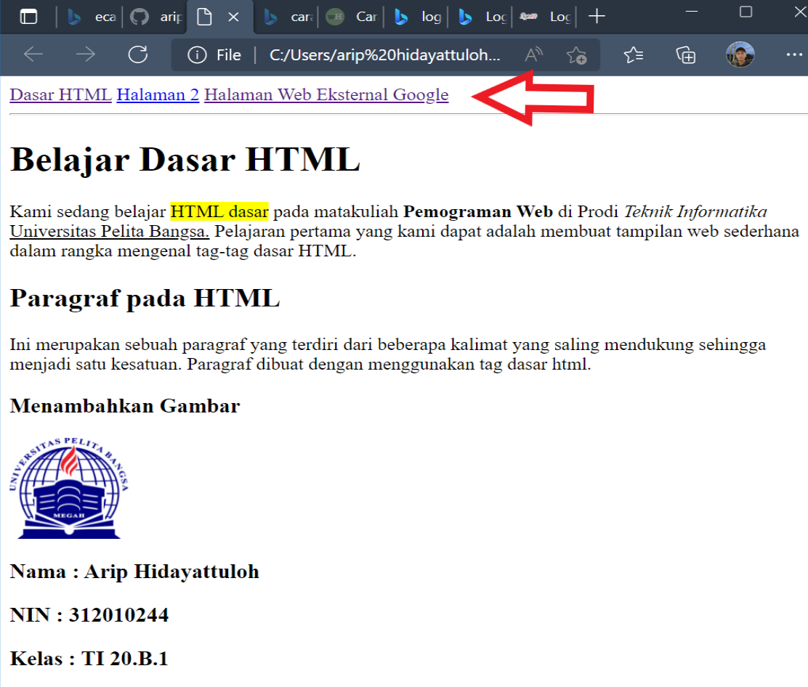

# Praktikum Pemograman Web
Nama  : Arip Hidayattulo

Nim   : 312010244

Kelas : TI.20.B.1

## Langkah-langkah Praktikum
Persiapan membuka VSCode dan Browser.

### Kemudian buat file baru dengan nama lab1_tag_dasar.html dan tambahkan tag dasar dokumen
HTML.

Ini adalah tampilannya

#### Kemudian selanjutnya, buka file tersebut pada web browser misalnya Mozilla Firefox.

1. Membuat Paragraf
Selanjutnya buatlah beberapa paragraf sederhana sebagai berikut

 Selanjutnya simpan kembali perubahannya, dan lakukan refresh pada web browser, lihat hasilnya.

Dan hasilnya ada jarak antar paragraf

 Kemudian atur atribut paragraf seperti berikut, dan amati perubahanya.
 

hasilnya kalimat rata ke kanan

Simpan kembali dan amati perubahannya dengan melakukan refresh pada web browser.
Selanjutnya silakan ubah-ubah nilai atributnya (align => justify, left, right, dan center) untuk melihat
perbedaan lainnya.

2. Menambahkan Judul
Seperti sudah dijelaskan pada materi bahwa judul memiliki 6 level yaitu mulai h1 sampai h6.
Kemudian tambahkan judul h1 sebelum paragraf pertama dan tambahkan sub judul h2 sebelum
paragraf kedua.

Simpan perubahannya dan lihat hasilnya dengan melakukan refresh pada browser.

3. Memformat teks
Lakukan pemformatan teks yang ada pada paragraf yang sudah ada sebelumnya, mengacu kepada
penjelasan materi pemformatan teks, sehingga tampilannya seperti berikut.

4. Menyisipkan Gambar

Untuk menyisipkan gmbar, siapkan gambar yang akan disisipkan pada halaman web, kemudian
simpan file gambar tersebut satu folder dengan file dokumen html. Atau bisa juga menyisipkan
gambar dari website external.

Gambar akan ditampilkan apa adanya sesuai dengan ukuran aslinya. Untuk mengatur ukuran
gambar, dapat digunakan atribut witdh dan height dengan nilai integer yang disesuaikan.
disini saya menggunakan "widht= 100"

Simpan perubahannya, kemudian refresh browser.

5. Menambahkan Hyperlink
Tambahkan hyperlink pada dokumen sebelum heading 1 seperti berikut.

dan ini hasilnya setelah di refresh

Pertanyaan Soal

1. Lakukan perubahan pada kode sesuai dengan keinginan anda, amati perubahannya adakah error ketika terjadi kesalahan penulisan tag?

Jawab: 
Kadang saya salah dalam penulisan tag.Tapi masih bisa di tampilkan ke Browser tampilan di websitenya akan menjadi berantakan bila kita ada kesalahan. Jadi, saat kita menambahkan beberapa script HTML dan saat scriptnya sudah panjang sekali sampai puluhan baris biasanya. Yang menjadi kebiasaannya adalah sering lupa dengan aturan penulisan tag HTMLnya. Khususnya yang berpasangan seperti tag `“<buka></tutup>“` Biasanya ada yang menulis script tanda bukanya tapi lupa tag tutupnya sehingga semua pondasi jadi berubah

2. Apa perbedaan dari tag `
` dengan tag ` `, berikan penjelasannya!

Jawab: 
Sekilas fungsi tag `
` dan ` ` terkesan sama, yaitu untuk memulai baris baru atau bisa diibratkan sebagai fungsi enter pada keyboard, namun sebenarnya kedua tag html ini memiliki fungsi dan intruksi yang berbeda pada perintah html.`Tag 
` Tag ini berfungsi untuk memberi perintah paragraf baru pada halaman html, antara baris atau paragraf terbentuk jarak. Tag ini merupakan tag yang berpasangan, dimulai dengan tag pembuka `
` dan diakhiri dengan tag penutup `
` Tag ` `
Tag ` ` tag ini adalah tag tunggal tanpa diawali tag pembuka dan diakhiri tag penutup. Ia berdiri sendiri. Tag ` ` dituliskan pada kerangka html untuk memberikan perintah "break line", artinya meng intruksikan baris baru. Apa beda nya dengan tag paragraf .... ?, bedanya adalah baris baru yang dihasilkan tanpa memberi jarak dengan baris diatasnya. Jadi perbedaan yang mencolok dari kedua tag ini adalah pada jarak yang terbentuk. Kesimpulannya jika hanya ingin membuat baris baru tanpa jarak gunakan tag ` ` , tapi jika sobat ingin membuat baris baru namun memiliki jarak dengan paragraf diatasnya maka bungkuslah paragraf baru tersebut dengan sepasang tag `
` dan `
`

3. Apa perbedaan atribut title dan alt pada tag ``, berikan penjelasannya!

Jawab:
Perbedaan yaitu pada gambar yang di tampilkan pada browser Title Parameter title pada tag `` berfungsi sebagai memberikan judul pada gambar dan judul / title akan tampil jika cursor kita arahkan pada gambar

4. Untuk mengatur ukuran gambar, digunakan atribut width dan height. Agar tampilan gambar proporsional sebaiknya kedua atribut tersebut diisi semua atau tidak? Berikan penjelasannya!

jawaban:
Menurut saya agar tampilan gambar proporsional sebaiknya menggunakan satu atribut.Agaraspecratio gambar asli tetap terjaga.

5. Pada link tambahkan atribut target dengan nilai atribut bervariasi ( `_blank`, `_self`, `_top`, `_parent` ), apa yang terjadi pada masing-masing nilai antribut tersebut?.`

jawaban:

`Nilai _blank akan membuka link/halaman di tab baru.`

`Nilai _self akan membuka link/halaman di tab saat ini.`

`Nilai _top membuka link/halaman dan membatalkan semua frame.`

`Nilai _parent membuka link/halaman pada parent frame.`

sekian dari saya 

-Arip hidayattuloh-